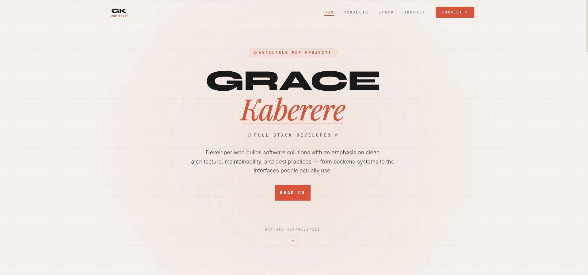

# Grace Kaberere — Portfolio

A personal portfolio site built with Next.js, showcasing projects, skills, and a working contact form.

**Live site:** [add deployed URL here]



## Features

- ⚡️ Built on the Next.js App Router with TypeScript
- 🎨 Smooth, subtle animations via Framer Motion
- 📬 Working contact form with email delivery through Nodemailer (SMTP)
- 🛡️ Spam protection on the contact form:
  - Honeypot field to catch bots
  - Submission timing checks to flag scripted/instant submissions
  - Rate limiting to prevent abuse
- 🖼️ Optimized images via `next/image`
- 📱 Fully responsive design

## Tech Stack

| Category   | Technology                     |
|------------|---------------------------------|
| Framework  | Next.js (App Router)            |
| Language   | TypeScript                      |
| Animation  | Framer Motion                   |
| Email      | Nodemailer (SMTP)               |
| Styling    | Tailwind CSS                    |
| Deployment | Vercel                          |

## Getting Started

### Prerequisites

- Node.js 18+ and npm/yarn/pnpm
- SMTP credentials for the contact form (e.g. Gmail app password, SendGrid, etc.)

### Installation

```bash
git clone https://github.com/KaberereG/Portfolio.git
cd [your project folder]
npm install
```

### Environment Variables

Create a `.env.local` file in the project root:

```env
SMTP_HOST=your-smtp-host
SMTP_PORT=587
SMTP_USER=your-smtp-username
SMTP_PASSWORD=your-smtp-password
CONTACT_EMAIL_TO=your-receiving-email@example.com
```

> Adjust variable names to match whatever you actually named them in your Nodemailer config.

### Run Locally

```bash
npm run dev
```

Visit [http://localhost:3000](http://localhost:3000) to view the site.

### Build for Production

```bash
npm run build
npm start
```

## Project Structure

```
├── app/                  # App Router pages and layouts
│   ├── page.tsx          # Home page
│   ├── api/
│   │   └── contact/      # Contact form API route (Nodemailer + spam checks)
│   └── ...
├── components/           # Reusable UI components
├── public/                # Static assets (images, icons)
└── ...
```

> Update this to reflect your actual folder layout.

## Contact Form Spam Prevention

The contact form API route includes three layers of protection before an email is sent:

1. **Honeypot field** — a hidden input that's invisible to real users but often filled in by bots; any submission with it populated is silently rejected.
2. **Timing check** — submissions completed faster than a human plausibly could (e.g. under 2–3 seconds) are flagged as automated.
3. **Rate limiting** — caps the number of submissions allowed from the same source within a time window.

## Deployment

This project is deployed on vercel. Push to `main` to trigger a new deployment, or deploy manually with:

```bash
[add your deploy command, e.g. vercel --prod]
```

Remember to add the SMTP environment variables in your hosting provider's dashboard as well.

## License

["All rights reserved"]

## Author

**Grace Kaberere**
